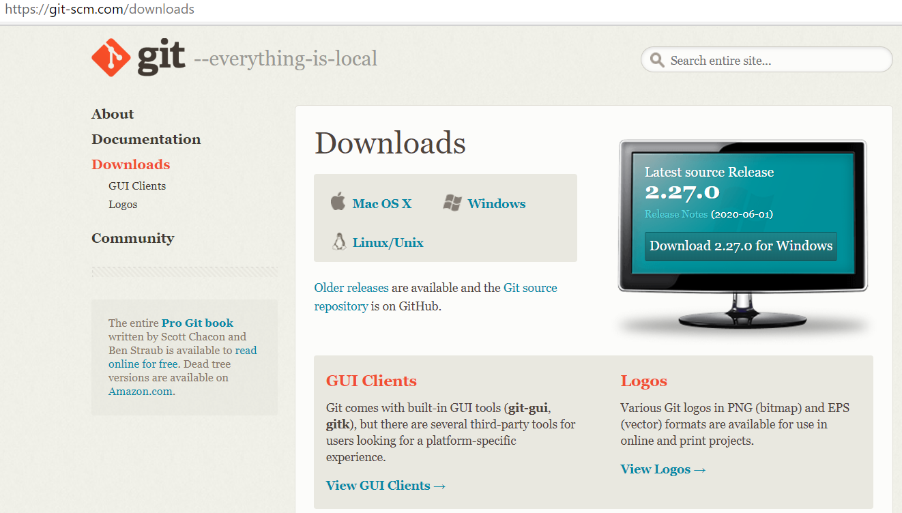
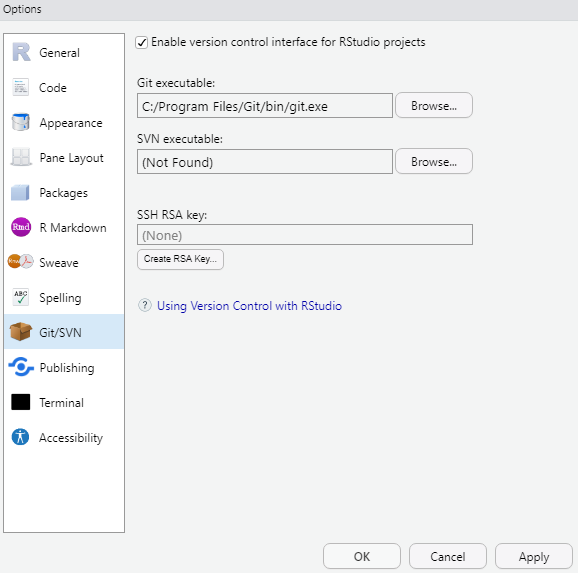
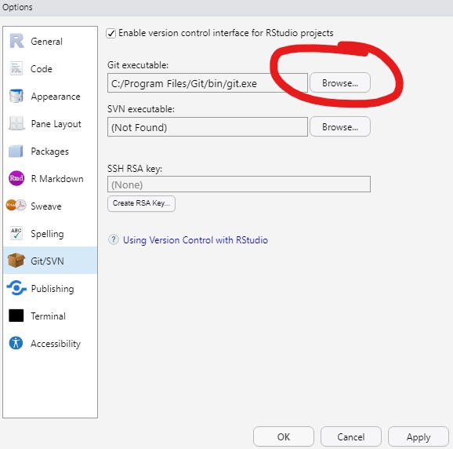
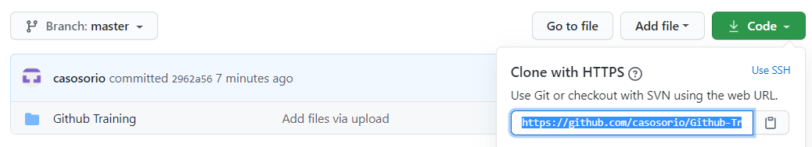
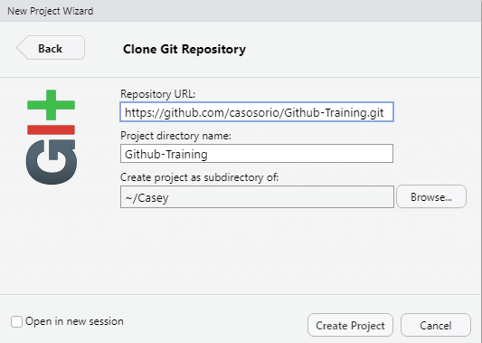
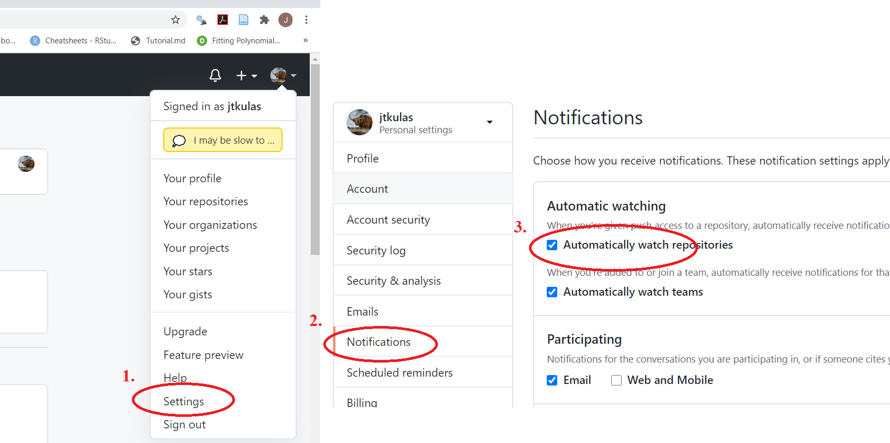

```{r setup, include=FALSE}
knitr::opts_chunk$set(echo = FALSE)
```

## Installing Git

Git is platform tool, which helps connect the website Github <https://github.com/>, and R studio. To install Git on you computer go to website <https://git-scm.com/downloads>. Here is what the website should look like:  

{width=50%}

Note that there is a decent YouTube tutorial [here](https://www.youtube.com/watch?v=Pg8LeOfvQME)

## Part 1: Connect Git to R 

- Go to Tools in RStudio; it is between Profile and Help. 
- Then, click on Global Options
- Next, click on Git/SVN 

{width=50%}

## Part 2: Connect Git To R

{width=35%}

- On a windows computer, you go to "this PC"
- Click on "Windowns (C:)"
- Click on "Program Files Folder"
- Click on "Git Folder"
- Click on "bin folder"
- Click on "git.exe"

You are now connect to Github with Rstudio.

## Example of how to use it.

- You will go to New Project.
- Then, you go to verison control, and click on Git.
- Now, you want go to Github, and click on code, then highlight the link. Like below:

{width=65%}


- Paste it in to repo

{width=45%}

<<<<<<< HEAD
## Learning Github

- Github is platform, where people can post files and collaborate on projects together. 
=======
## Options

You can set up notifications via your *global* options (associated with your account - not specific to any one repository):

{width=90%}
>>>>>>> 6a9f4ea26ce99d6ac32ee01e0085c681dbf2b2f3
